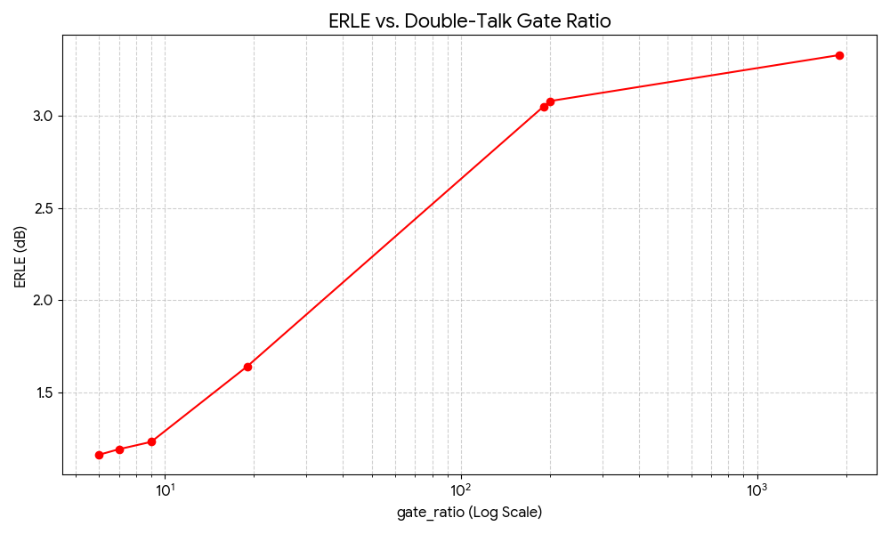
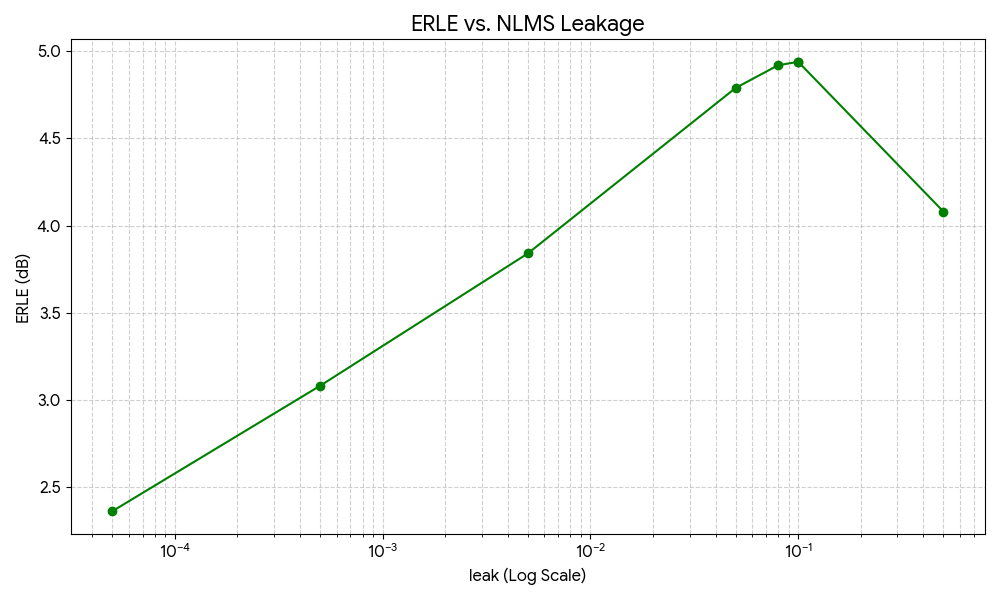
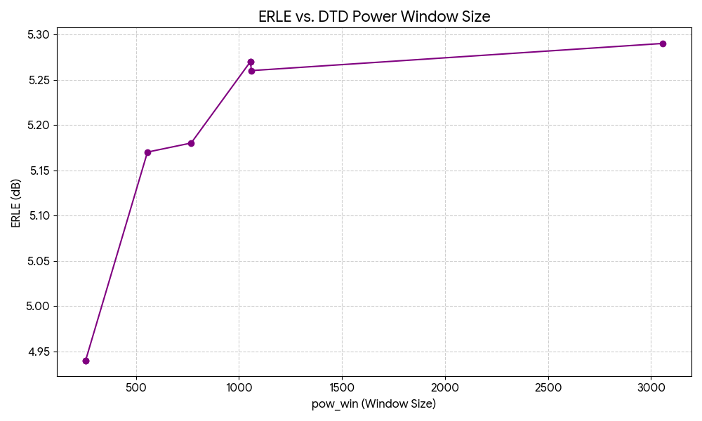

*This project is part of our [Machine Listening & Audio ML Portfolio](https://github.com/Farrell-Audio-Research/audio-ml-portfolio).*

# NLMS Filter for AEC: A Baseline Analysis

**Authors:** Conner O. Farrell & Mark Farrell (Fall 2025)

---

## 🧭 Overview

This project implements a robust, manually-tuned **NLMS (Normalized Least Mean Squares)** filter for Acoustic Echo Cancellation (AEC).

The work was initiated during an investigation of the [Meta-AF: Meta-Learning for Adaptive Filters](https://arxiv.org/abs/2005.02380) paper. Before benchmarking the full meta-learning model, we first needed to establish a strong performance baseline using a classical approach.

This repository provides the code for that baseline. It is designed to plug directly into the MetaAF framework (using checkpoint **v1.0.1**) to reproduce a CPU-only inference run, allowing for a direct and fair comparison between the models.

---

## ⚙️ Core Baseline Features

The core of our baseline is in the `patches/aec_infer.py` file, which implements:

* **Leaky NLMS Algorithm:** The core is a standard NLMS update with a `leak` factor. This acts as a regularization, preventing the filter weights from drifting and becoming unstable.
* **Double-Talk Detection (DTD):** A critical component to ensure robustness. The filter automatically freezes adaptation when the near-end user is speaking by comparing the moving-average power of the mic and reference signals.
* **Performance Metric:** The primary metric for success is **ERLE (Echo Return Loss Enhancement)**, which is calculated in dB for each processed audio file.

---

## 📁 Repo Structure

```bash

project-1-nlms-aec/
├── env/
│   ├── environment.yml                  \# Minimal conda spec
│   └── requirements.lock.txt            \# Exact pip freeze
├── graphs/
│   ├── ERLE_DoubleTalkGateRatio.png     \# Graph of Gate Ratio Tuning
│   ├── ERLE_Leak.png                    \# Graph of Leakage Tuning
│   └── ERLE_DTD_Power_Window_Size.png   \# Graph of Power Window Tuning
├── patches/
│   ├── aec_infer.py                     \# Our NLMS baseline (replaces the MetaAF one)
│   └── learners.py                      \# Model loader + small dataset shim
├── results/
│   ├── my_speech.wav                    \# Optional sample input
│   ├── ref.wav                          \# Optional sample input
│   └── mic_aec_out.wav                  \# Produced by run_aec.py
├── scripts/
│   └── apply_patches.sh                 \# Copies patches into installed metaaf package
├── run_aec.py                           \# Simple driver script
└── README.md

````

---

## 🚀 Setup and Execution

### 1. Environment

We created the env with conda and pinned a small, compatible CPU stack (JAX CPU, classic SoundFile pin). See `env/requirements.lock.txt` (exact pip freeze) and `env/environment.yml` (minimal conda spec).

Key pins we used:
* `SoundFile==0.10.3.post1`
* `jax==0.3.25`, `jaxlib==0.3.25` (CPU)
* numpy/scipy/librosa as per the lockfile

> **Disk-quota-friendly tips:**
> ```bash
> export PIP_CACHE_DIR=/tmp/$USER/pip-cache
> export TMPDIR=/tmp/$USER/tmp
> export PIP_NO_CACHE_DIR=1
> mkdir -p "$PIP_CACHE_DIR" "$TMPDIR"
> mkdir -p /tmp/$USER/conda_pkgs
> conda config --add pkgs_dirs /tmp/$USER/conda_pkgs
> ```

### 2. One-Time Setup (after conda env is active)

1.  Install MetaAF from source in editable mode (so patches take effect):
    ```bash
    # (Adjust path to wherever you cloned the main MetaAF repo)
    pip install --no-deps -e /nethome/<user>/src/MetaAF
    ```

2.  Apply our two patches into the installed package:
    ```bash
    ./scripts/apply_patches.sh
    ```

3.  Put the official models under a directory like:
    ```
    /nethome/<user>/metaaf_models/v1.0.1_models/aec/2022_10_19_23_43_22/...
    ```

### 3. Run Example

```bash
# Example (adjust paths)
python run_aec.py \
  --mic ./results/my_speech.wav \
  --ref ./results/ref.wav \
  --model_dir /nethome/<user>/metaaf_models/v1.0.1_models/aec \
  --out ./results/mic_aec_out.wav
````

The script calls our patched `learners.load_pretrained_model(...)`, which loads the AEC checkpoint, plugs in our custom `fit_infer(...)` function from `aec_infer.py`, and writes the residual (`mic_aec_out.wav`).

-----

## 📈 Results: Baseline Parameter Tuning

The key to a strong baseline is careful tuning. We methodically tuned three critical hyperparameters to find the optimal balance between echo cancellation, stability, and robustness.

The final optimized filter improved the ERLE from an initial **1.13 dB** to a stable **5.29 dB**.

### 1\. The `gate_ratio` Trade-off (Adaptation vs. Robustness)

The `gate_ratio` for the double-talk detector was the most impactful parameter.

  * **Too Low (e.g., 6.0):** The detector is overly sensitive and constantly freezes the filter. This prevents the filter from ever adapting, resulting in a poor ERLE of \~1.2 dB.
  * **Too High (e.g., 1900.0):** The detector is insensitive. It fails to freeze during double-talk, causing the filter to adapt to the near-end user's voice and diverge.
  * **Optimal (e.g., 200.0):** Provides the best balance, allowing the filter to adapt aggressively during echo-only periods while correctly freezing during double-talk.



### 2\. The `leak` Trade-off (Stability vs. Tracking Speed)

The `leak` parameter was crucial for long-term filter stability.

  * **Too Low (e.g., 5e-05):** The filter has no regularization. The weights are free to drift, leading to instability (ERLE: \~2.4 dB).
  * **Too High (e.g., 0.5):** The filter "forgets" what it learns at every step. This high bias prevents it from fully converging and canceling the echo (ERLE: \~4.1 dB).
  * **Optimal (e.g., 0.1):** Provides just enough regularization to ensure stability without sacrificing the filter's speed and ability to track the echo.



### 3\. The `pow_win` Trade-off (Detector Responsiveness vs. Stability)

The `pow_win` parameter controls the smoothing of the power estimates used by the DTD.

  * **Too Low (e.g., 256):** The power estimate is fast but very noisy. This causes the DTD to "flutter" (rapidly freeze/unfreeze), harming performance.
  * **Optimal (e.g., \~1000-3000):** A larger window provides a smooth, stable power estimate. This makes the DTD's decisions more reliable, leading to the highest and most stable ERLE.



### Final Optimal Parameters

This tuning process provided a strong set of baseline parameters for this AEC task:

| Parameter | Value |
| :--- | :--- |
| Filter Length (`L`) | 1800 |
| Step Size (`mu`) | 0.6 |
| Leakage (`leak`) | 0.1 |
| Gate Ratio (`gate_ratio`) | 200.0 |
| Power Window (`pow_win`) | 3056 |
| **Final ERLE** | **5.29 dB** |

-----

## 🏁 Conclusion

This project successfully implemented a robust NLMS-based AEC system and established a strong performance baseline of **5.29 dB ERLE**.

More importantly, the manual tuning process provided a deep, hands-on understanding of the *exact problems* (parameter sensitivity, competing trade-offs) that motivate the need for modern, data-driven solutions like Meta-AF.

The clear next step is to use this tuned baseline to formally benchmark the full Meta-AF model and quantify its advantages.

-----

## 📝 Notes

  * We keep the patches separate so it’s obvious what changed from upstream.
  * If you rebuild your env, re-run `./scripts/apply_patches.sh`.
  * If your input WAVs are not 16 kHz mono, resample first (or add resampling to `run_aec.py`).

---
**Authors:** Conner O. Farrell & Mark Farrell (Fall 2025)
